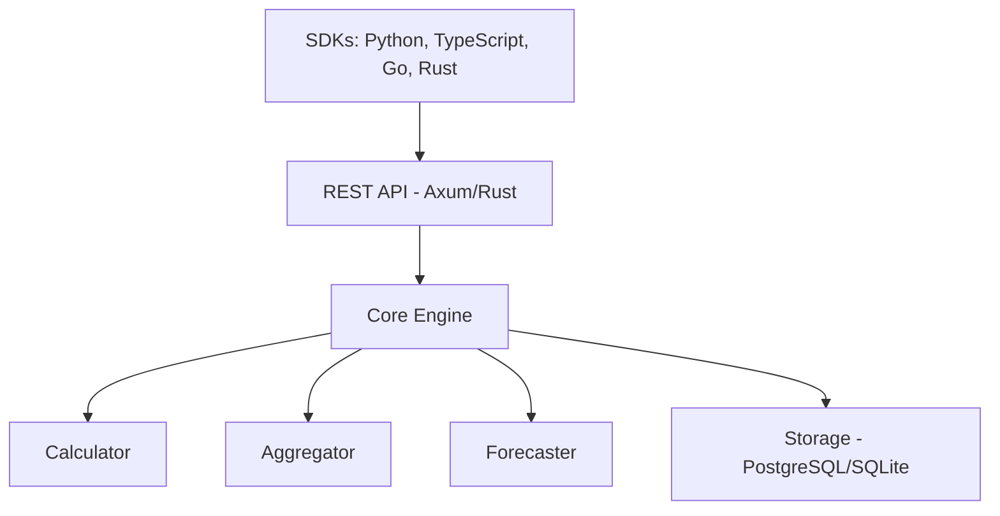

# Introduction to LLM-CostOps

Enterprise-grade cost operations platform for LLM infrastructure. Track, analyze, and optimize costs across multiple LLM providers with production-ready accuracy.

## What is LLM-CostOps?

LLM-CostOps is a comprehensive platform designed to help organizations manage and optimize their Large Language Model (LLM) costs across multiple providers. Whether you're using OpenAI, Anthropic, Google Vertex AI, Azure OpenAI, or AWS Bedrock, LLM-CostOps provides the tools you need to:

- **Track Costs in Real-Time**: Monitor spending as it happens with 10-decimal precision
- **Analyze Usage Patterns**: Understand how your organization uses LLMs
- **Forecast Future Costs**: Predict spending with advanced forecasting models
- **Optimize Spending**: Identify opportunities to reduce costs without sacrificing quality
- **Generate Reports**: Create comprehensive reports for stakeholders

## Key Features

### Multi-Provider Support

Track costs across all major LLM providers:
- OpenAI (GPT-4, GPT-3.5, etc.)
- Anthropic (Claude 3 family)
- Google Vertex AI (PaLM, Gemini)
- Azure OpenAI
- AWS Bedrock
- Cohere
- Mistral

### High-Precision Cost Tracking

- **10-decimal precision** using Rust's rust_decimal for accurate financial calculations
- **Comprehensive token accounting**: Prompt, completion, cached, and reasoning tokens
- **Flexible pricing models**: Per-token, per-request, tiered volume pricing
- **Historical pricing**: Track pricing changes over time

### Advanced Analytics

- **Time-series forecasting**: Linear trend, moving average, exponential smoothing
- **Anomaly detection**: Identify unusual spending patterns with Z-score and IQR methods
- **Budget forecasting**: Predictive alerts with confidence intervals
- **Trend analysis**: Automatic trend direction and seasonality detection

### Enterprise Features

- **Multi-tenancy**: Organization and project-level isolation
- **RBAC**: Role-based access control with fine-grained permissions
- **Audit logging**: Comprehensive audit trail for compliance
- **API key management**: Secure API key generation with SHA-256 hashing
- **JWT authentication**: Token-based auth with refresh tokens

### Observability

- **Prometheus metrics**: 40+ metrics for HTTP, costs, database, auth, forecasting
- **Distributed tracing**: OpenTelemetry Protocol (OTLP) with correlation IDs
- **Structured logging**: JSON format with trace context integration
- **Health checks**: Liveness, readiness, and startup probes

### Export & Reporting

- **Multiple formats**: CSV, JSON, Excel (XLSX), JSON Lines
- **Scheduled reports**: Cron-based scheduling with timezone support
- **Email delivery**: SMTP with TLS/STARTTLS and HTML templates
- **Multi-channel delivery**: Email, local storage, S3, webhooks

## Architecture

LLM-CostOps is built with a modern, scalable architecture:

## Use Cases

### DevOps Teams
Monitor and optimize LLM infrastructure costs across development, staging, and production environments.

### Finance Teams
Generate accurate cost reports for budgeting and forecasting with detailed breakdowns by provider, model, and project.

### Product Teams
Track feature-specific LLM costs to understand the ROI of AI-powered features.

### Compliance Teams
Maintain comprehensive audit trails and access controls for regulatory compliance.

## Getting Started

Choose your preferred SDK to get started:

- [Python SDK](/docs/sdks/python/) - For data science and backend applications
- [TypeScript SDK](/docs/sdks/typescript/) - For Node.js and browser applications
- [Go SDK](/docs/sdks/go/) - For high-performance backend services
- [Rust SDK](/docs/sdks/rust/) - For systems programming and maximum performance

Or jump straight to:

- [Quick Start Guide](/docs/getting-started/quick-start)
- [Installation](/docs/getting-started/installation)
- [Authentication](/docs/getting-started/authentication)

## Community & Support

- **Documentation**: https://docs.llm-cost-ops.dev
- **GitHub**: https://github.com/llm-devops/llm-cost-ops
- **Issues**: https://github.com/llm-devops/llm-cost-ops/issues
- **Discord**: https://discord.gg/llm-cost-ops

## License

LLM-CostOps is dual-licensed under Apache 2.0 and MIT licenses.
